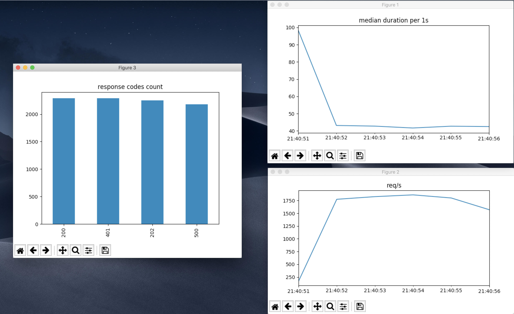

|build status| |coverage status| |pypi package|

AIOload
=======

https://blog.mogollon.com.ve/2020/01/10/load-testing-with-python/

Load test tool using aiosonic_ http client. For drawing charts we
use matplotlib and pandas.

Usage of uvloop is highly recommended.

Requirements
============

-  python>=3.6

Installation
============

.. code:: bash

  pip install aioload
  # optional, highly recommended
  pip install uvloop

Usage
=====

you need to specify your request in a settings file like **config.ini**

.. code:: ini

   [http]
   sock_read = 30
   sock_connect = 3

   [test]
   # target url for test
   url = http://localhost:8080/api/v1/something
   # methods: get, post, put, delete
   method = post
   #
   # use body for send body in request
   # if body is json, indicate correct header in headers section
   # comment body line if you're doing a get request
   body = '{"foo": "bar"}'

   # query params if needed, this will transform url
   # in something like http://localhost:8080/api/v1/something?token=something
   [params]
   token = something

   # headers if needed
   [headers]
   content-type = application/json

usage example

.. code:: bash

   > aioload -h
   usage: aioload [-h] [-d] [-v] [-n NUMBER_OF_REQUESTS] [-c CONCURRENCY]
                  [--plot]
                  testfile
   
   positional arguments:
     testfile              Test file to be executed
   
   optional arguments:
     -h, --help            show this help message and exit
     -d, --debug           true if present
     -v, --verbose         true if present
     -n NUMBER_OF_REQUESTS, --number_of_requests NUMBER_OF_REQUESTS
                           number of requests to be done, default: 100
     -c CONCURRENCY, --concurrency CONCURRENCY
                           concurrency (requests at the same time), default: 10
     --plot                draw charts if present

   > aioload config.ini -n 3000 -c 100 --plot -v
   2019-05-29 17:20:51,662 - __init__:135 - info - 8cf56ded860f41d8a86dab2aed05218f - starting script... -
   2019-05-29 17:20:55,301 - __init__:102 - info - 8cf56ded860f41d8a86dab2aed05218f - done - min=14.54ms; max=212.21ms; mean=109.36ms; req/s=600.0; req/q_std=333.7; stdev=24.65; codes.200=3000; concurrency=100; requests=3000;

You can override aioload runner methods, here_ is an example. Then you should execute the script you made, in this example: ``python sample/dynamic_test.py conf.ini -v``

Note
====

Python has limits, if your applications is crazy fast like this_ crystal server, the test will be limited by aiosonic's client speed.

Contribute
==========

1. fork
2. create a branch ``feature/your_feature``
3. commit - push - pull request

Dependencies are handled with pip-tools_

thanks :)

.. _this: ./sample/server.cr
.. _aiosonic: https://github.com/sonic182/aiosonic
.. _here: https://github.com/sonic182/aioload/blob/master/sample/dynamic_test.py
.. _pip-tools: https://github.com/jazzband/pip-tools
.. |build status| image:: https://travis-ci.org/sonic182/aioload.svg?branch=master
   :target: https://travis-ci.org/sonic182/aioload
.. |coverage status| image:: https://coveralls.io/repos/github/sonic182/aioload/badge.svg?branch=master
   :target: https://coveralls.io/github/sonic182/aioload?branch=master
.. |pypi package| image:: https://badge.fury.io/py/aioload.svg
    :target: https://badge.fury.io/py/aioload
